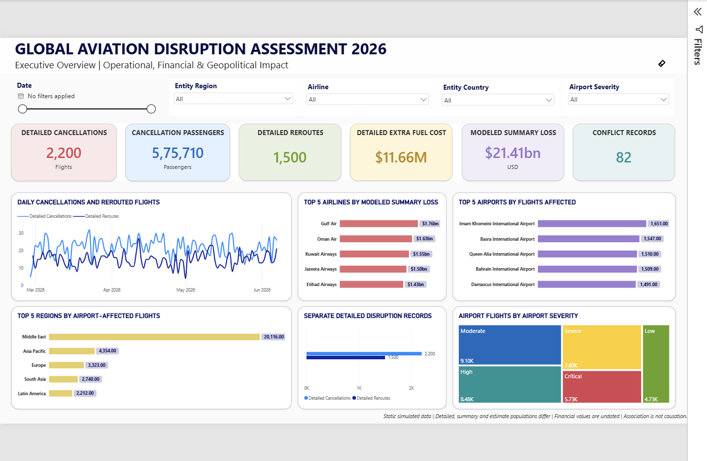

# Global Aviation Disruption Assessment 2026

A business intelligence portfolio project that uses **Python, PostgreSQL and Power BI** to analyse aviation disruption records, regional exposure and modeled financial scenarios.

The project follows seven Kaggle datasets from raw CSV files through cleaning, SQL analysis and a four-page interactive report. Its main analytical challenge is preserving different source populations so that similar-looking metrics are not combined into misleading results.

> **Data context:** This is a static case study using simulated and modeled data. It is not a live aviation system, an official assessment or evidence of real-world causal effects.

## Dashboard preview



| Report page | What it shows |
|---|---|
| [Executive Overview](visuals/PowerBI_SS/01_Executive_Overview.png) | Detailed cancellations, passengers, reroutes, fuel cost, airport exposure and event context |
| [Modeled Financial Scenarios](visuals/PowerBI_SS/02_Modeled_Financial_Scenarios.png) | Separate airline-loss summaries and daily estimates, with population-specific ratios |
| [Geopolitical & Operational Disruption](visuals/PowerBI_SS/03_Geopolitical_Operational_Disruption.png) | Disruption timelines, cancellation reasons, airport impact and airspace closures |
| [Regional Risk & Corridor Vulnerability](visuals/PowerBI_SS/04_Regional_Corridor_Vulnerability.png) | Directional route corridors, additional distance and separate regional exposures |

## Business questions

- Where and when are detailed cancellation and reroute records concentrated?
- What passenger, distance, fuel-cost and delay burdens appear in those records?
- Which airports and airspace closures have the highest reported exposure?
- Which airlines and regions show the greatest modeled financial exposure?
- How do disruption counts differ between military-event and other dates within shared source coverage?

## Selected findings

These figures describe the supplied snapshot, not verified aviation activity or audited financial losses.

- **Operational detail:** 2,200 cancellation records contain 575,710 affected passengers. The separate reroute dataset has 1,500 records, 2.20 million additional kilometres, USD 11.66 million in extra fuel cost and 4,706.30 delay hours.
- **Airport concentration:** The Middle East accounts for 56.12% of reported airport-affected flights within the airport dataset.
- **Route concentration:** Europe to Middle East is the leading detailed reroute corridor, with 196 records, or 13.07% of that dataset. The reverse direction is a separate corridor.
- **Financial scenarios:** The 70-airline modeled summary reports USD 21.41 billion in loss. A separate 35-airline estimate reports USD 48.84 million in daily loss; these values are not one financial series.
- **Event-date comparison:** Within the shared 100-day operational window, mean cancellations are 21.08 on military-event dates and 22.07 on other dates. This descriptive comparison does not establish a conflict effect.

See the [Executive Findings](documentation/Global%20Aviation%20Disruption%20Assessment%20Executive%20Findings.docx) for source definitions, calculations and interpretation limits.

## Technical approach

```text
Kaggle CSV snapshot
    → Python cleaning and validation
    → Clean UTF-8 CSV files
    → PostgreSQL analytical tables
    → SQL analysis and reporting views
    → Power BI Import model
    → Four report pages
```

| Layer | Implementation |
|---|---|
| Python | Seven source-specific ETL scripts and shared helpers; schema, date, range, formula and row-preservation checks |
| PostgreSQL | Seven source-aligned tables, explicit constraints and transactional UTF-8 loading |
| SQL | Six analytical scripts, population-specific financial views and post-load reconciliation |
| Power BI | Import mode, explicit DAX measures, one-direction relationships and separate origin/destination geography |
| Validation | Raw-to-clean reconciliation, clean-to-database equality, control totals and representative model-filter tests |

The [architecture diagram](visuals/Architecture/Project%20Architecture.png) shows the pipeline. The [database and semantic-model diagram](visuals/ERD/ERD%20-1.png) distinguishes PostgreSQL tables from Power BI relationships.

### Skills demonstrated

- Data profiling, cleaning and reproducible ETL
- SQL aggregation, joins, views and validation
- Data-grain and metric-population reconciliation
- Power BI modeling, DAX and filter-context design
- Business requirements, metric documentation and evidence-based interpretation

## Data reconciliation: the key design decision

The source files describe related concepts but do not prove a shared population.

| Metric population | Source | Size |
|---|---|---|
| Detailed cancellations and cancellation passengers | `flight_cancellations` | 2,200 records |
| Detailed reroutes, distance, fuel and delay | `flight_reroutes` | 1,500 records |
| Modeled airline-loss summary | `airline_losses` | 70 airlines |
| Modeled daily airline estimates | `airline_losses_estimate` | 35 airlines |
| Airport disruption exposure | `airport_disruptions` | 227 records |
| Airspace closure exposure | `airspace_closures` | 84 records |
| Conflict-event context | `conflict_events` | 82 records |

For example, the modeled summary contains 6,030 cancellations and 4,539 reroutes, while the detailed datasets contain 2,200 and 1,500 records. These differences are retained and labeled; neither source is rewritten to force agreement. Financial ratios use values from the same financial population.

Airport and airspace affected-flight counts remain separate because no shared flight identifier supports deduplication. The 42 conflict records without a defensible country remain available without invented geography.

## Repository

```text
data/
  raw/             Original source CSVs
  clean/           Reproducible UTF-8 outputs
python/
  etl/             Seven cleaning scripts
  utils/           Shared validation helpers
sql/
  01_database/     Database, schema and tables
  02_loading/      Transactional psql loader
  03_validation/   Post-load and view checks
  04_analysis/     Six analytical scripts
  05_views/        Reporting interfaces
powerbi/           PBIP report and semantic-model source
documentation/     Business, technical, findings and audit documents
visuals/           Dashboard images, architecture and model diagrams
```

## Run locally

**Requirements:** Python 3.12 or later, PostgreSQL with `psql`, and Power BI Desktop with PBIP support. ETL reproduction was checked with Python 3.14.6 and pandas 3.0.3.

1. Clone the repository and create a local Python environment:

   ```powershell
   python -m venv .venv
   .\.venv\Scripts\Activate.ps1
   python -m pip install -r requirements.txt
   ```

2. Run the seven scripts in `python/etl/` in numeric order. They generate the corresponding clean CSV files.
3. Set up the local `aviation_bi` database: database → schema → tables → load → views → validation → analysis. Run the loader, `sql/02_loading/01_load_data.psql`, with **psql**, not a SQL query editor.
4. Open [the PBIP project](powerbi/Global%20Aviation%20Disruption%20Assessment%202026%20DASHBOARD.pbip). Keep its `.Report` and `.SemanticModel` folders beside it.
5. Connect Power BI to `localhost` / `aviation_bi`, enter your local PostgreSQL credentials and refresh the imported data.

**Rebuild warning:** Table creation and loading replace this project's existing table data. Use them only for deliberate local setup or rebuilding, not against an unrelated database. Never store credentials in source files.

The [Technical Documentation](documentation/Global%20Aviation%20Disruption%20Assessment%20Technical%20Documentation.docx) contains the complete commands, execution order, connection instructions and troubleshooting.

## Documentation

| Document | Purpose |
|---|---|
| [Business Requirements](documentation/Global%20Aviation%20Disruption%20Assessment%20Business%20Requirements.docx) | Problem statement, objectives, scope, KPI definitions and acceptance criteria |
| [Technical Documentation](documentation/Global%20Aviation%20Disruption%20Assessment%20Technical%20Documentation.docx) | Data lineage, transformations, schemas, views, model definitions and local setup |
| [Executive Findings](documentation/Global%20Aviation%20Disruption%20Assessment%20Executive%20Findings.docx) | Verified descriptive results and their limitations |

Supporting verification records: [complete audit](documentation/Complete%20Project%20Audit.md), [file inventory](documentation/Audit%20File%20Inventory.csv) and [change log](documentation/Remediation%20Change%20Log.md). Private study notes and historical documents are excluded from GitHub.

## Interpretation and verification limits

- Operational records begin in late February 2026; the wider calendar starts in December 2025 for conflict context. Earlier blank operational selections mean unavailable snapshot records, not confirmed zero disruption.
- Financial summaries and estimates are undated and do not change with date selections.
- Airspace date filters select closure start dates and sum complete durations, not hours prorated into the selected period.
- Estimated passengers per estimated reroute is a population-exposure ratio, not aircraft occupancy.
- No forecasting, causal attribution, mitigation effectiveness or official endorsement is claimed.
- Automated checks and representative model tests are recorded in the audit. Full manual interaction/accessibility acceptance and fresh-laptop setup are not claimed as passed.

## Source and licenses

Data: [Kaggle — Global Civil Aviation Disruption 2026 Iran–US War](https://www.kaggle.com/datasets/zkskhurram/global-civil-aviation-disruption2026-iranus-war). All seven files were downloaded in the first week of August 2026.

The dataset is attributed under **CC BY-SA 4.0**. Repository code is licensed under [MIT](LICENSE); that license does not replace the dataset license.

## Authors

Dhaerya Nauni and Honey Aggarwal
